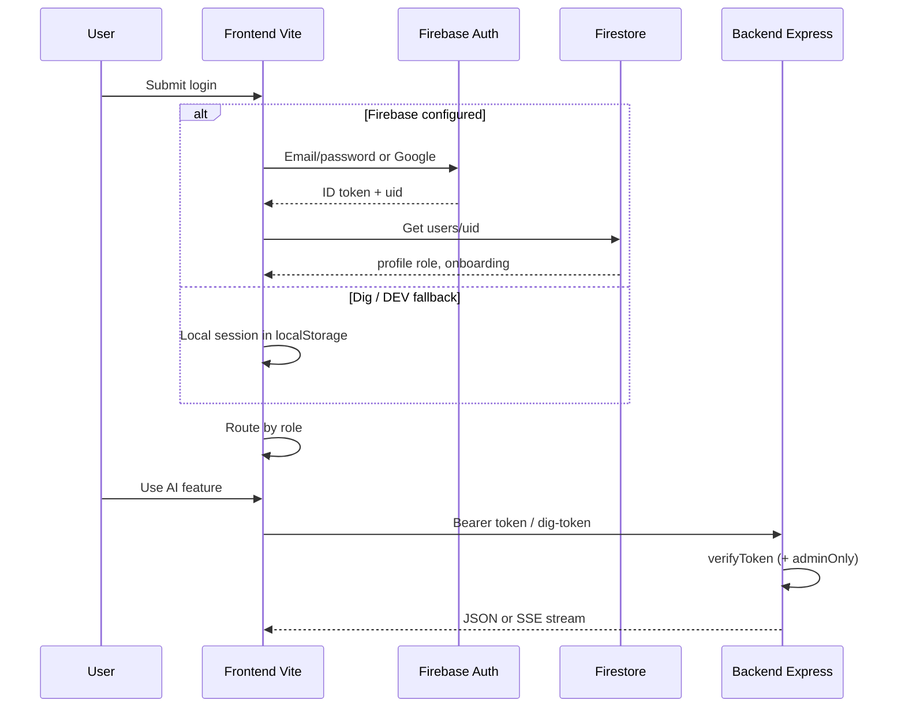
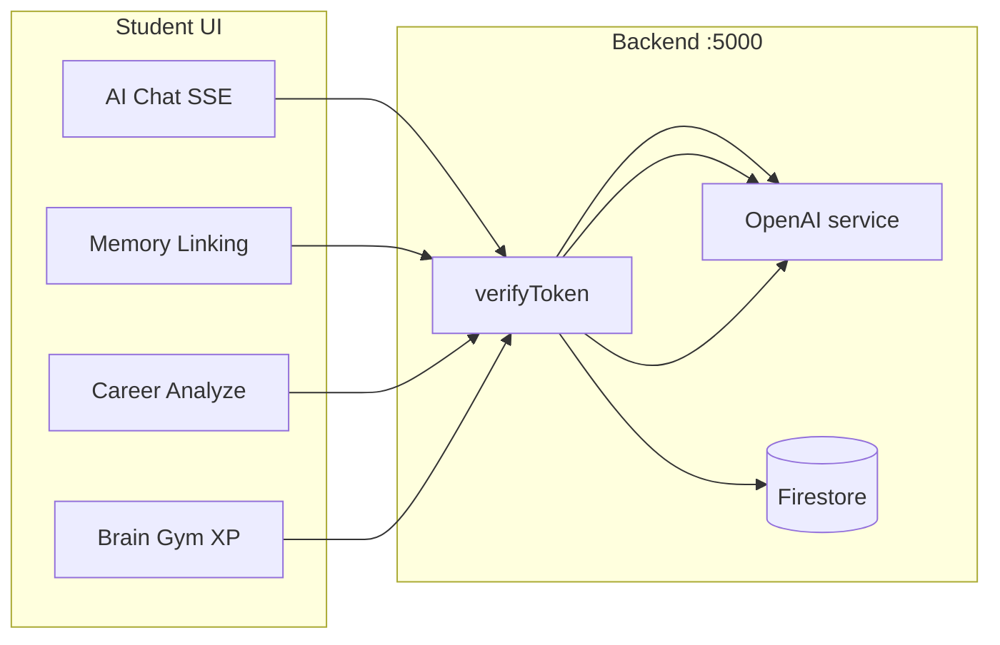

# AI Sajan Shah (`ai01`)

Personal AI mentoring platform inspired by **Sajan Shah** — memory coaching, goal setting, career guidance, and admin student management.

**Repository:** [github.com/Bwiktechnologies/ai01](https://github.com/Bwiktechnologies/ai01)

---

## Overview

| Layer | Stack |
|--------|--------|
| Frontend | React 19, Vite 8, React Router 7, Tailwind CSS 4, Framer Motion, Lucide, Recharts, Firebase Client |
| Backend | Node.js, Express 4, Firebase Admin, OpenAI, SendGrid |
| Data / Auth | Firebase Authentication + Firestore |

### Roles

- **Student** — AI chat mentor, memory linking (stories), career AI, Brain Gym, goals, hacks, profile
- **Admin** — student CRUD, CSV bulk upload, analytics, email logs, content/settings

---

## System workflow

```mermaid
flowchart TD
  A[User opens /login] --> B{Firebase configured?}
  B -->|Yes| C[Email / Google Firebase Auth]
  B -->|No + Vite DEV| D[Local dig session]
  C --> E[Load Firestore users/uid]
  E -->|Profile missing| F[Deny + sign out]
  E -->|OK| G{role}
  D --> G
  G -->|admin| H[/admin dashboard]
  G -->|student| I{onboardingComplete?}
  I -->|No| J[/onboarding]
  I -->|Yes| K[/student app]
  K --> L[Chat / Linking / Career / Brain Gym]
  L --> M{API / OpenAI available?}
  M -->|Yes| N[Express API + OpenAI]
  M -->|No dig mode| O[Local stub responses]
  H --> P[Admin APIs + Firestore]
```

### Auth & routing flow



### Student AI feature flow



---

## Project structure

```
ai01/
├── frontend/                 # Vite + React SPA
│   ├── src/
│   │   ├── pages/            # Login, Onboarding, student/*, admin/*
│   │   ├── components/       # Layout, auth guards, chat, UI
│   │   ├── contexts/         # AuthProvider, ThemeContext
│   │   ├── utils/            # api.js + dig fallbacks
│   │   ├── firebase.js
│   │   └── App.jsx           # Routes
│   └── .env.example
└── backend/                  # Express API
    ├── server.js             # Routes
    ├── middleware/           # verifyToken, adminOnly
    ├── services/             # openai, sendgrid
    ├── firebase-admin.js
    └── .env.example
```

---

## Key routes

### Student (`ProtectedRoute`)

| Path | Feature |
|------|---------|
| `/student` | Dashboard |
| `/student/chat` | AI Sajan chat (streaming) |
| `/student/paragraph-tool` | Memory story / Linking |
| `/student/career` | Career path analysis |
| `/student/neuroscience` | Brain Gym |
| `/student/goals`, `/roadmaps`, `/mental-health`, `/life-hacks`, `/study-hacks`, `/profile` | Mentoring content |
| `/onboarding` | First-time profile setup |

### Admin (`AdminRoute`)

| Path | Feature |
|------|---------|
| `/admin` | Analytics dashboard |
| `/admin/students` | List / manage students |
| `/admin/add-student` | Create student + welcome email |
| `/admin/upload-csv` | Bulk upload |
| `/admin/email-logs` | Email history |
| `/admin/prompt-editor`, `/content`, `/settings` | Content & settings |

---

## API endpoints

| Method | Path | Auth | Description |
|--------|------|------|-------------|
| `GET` | `/api/health` | — | Health check |
| `POST` | `/api/chat` | Token | Mentor chat (SSE) |
| `POST` | `/api/memory-story` | Token | Memory story from text |
| `POST` | `/api/career/analyze` | Token | Career roadmap JSON |
| `POST` | `/api/braingym/score` | Token | Save Brain Gym XP |
| `POST` | `/api/student/activity` | Token | Activity ping |
| `GET` | `/api/admin/stats` | Admin | Dashboard stats |
| `GET` / `POST` | `/api/admin/students` | Admin | List / create |
| `DELETE` | `/api/admin/students/:id` | Admin | Remove student |
| `POST` | `/api/admin/bulk-upload` | Admin | CSV bulk create |
| `GET` | `/api/admin/email-logs` | Admin | Email logs |

Default API port: **5000** (`PORT` in `backend/.env`).  
Frontend base URL: `VITE_API_BASE_URL` (see `frontend/src/utils/api.js`).

---

## Setup

### 1. Clone

```bash
git clone https://github.com/Bwiktechnologies/ai01.git
cd ai01
```

### 2. Backend

```bash
cd backend
cp .env.example .env
npm install
npm run dev
```

Configure in `backend/.env`:

- `PORT`
- `OPENAI_API_KEY`
- `SENDGRID_API_KEY` / `SENDGRID_FROM_EMAIL`
- `FIREBASE_PROJECT_ID` / `FIREBASE_CLIENT_EMAIL` / `FIREBASE_PRIVATE_KEY`
- `DEV_AUTH=true` (optional; dig tokens for local testing)

### 3. Frontend

```bash
cd frontend
cp .env.example .env
npm install
npm run dev
```

Configure in `frontend/.env`:

- `VITE_FIREBASE_*` (API key, auth domain, project id, storage bucket, messaging sender id, app id)
- `VITE_API_BASE_URL=http://localhost:5000`

App: **http://localhost:5173**

### Dig / local mode

If Firebase client env vars are empty and Vite is in development:

- Frontend can use a local dig auth session
- AI tools may use local stub replies when OpenAI is unavailable
- Backend accepts `Bearer dig-token-{uid}` when `DEV_AUTH=true`

For production, configure Firebase + OpenAI fully and do not rely on dig mode.

---

## Scripts

| Location | Command | Purpose |
|----------|---------|---------|
| `backend` | `npm start` | Run API |
| `backend` | `npm run dev` | Nodemon dev reload  |
| `frontend` | `npm run dev` | Vite dev server |
| `frontend` | `npm run build` | Production build |
| `frontend` | `npm run preview` | Preview build |

---

## Architecture notes

1. **Role source of truth** — Firestore `users/{uid}.role` (`admin` | `student`), not only Auth custom claims.
2. **Onboarding gate** — Students without `onboardingComplete` are sent to `/onboarding`.
3. **Chat** — Server-Sent Events (`text/event-stream`); other AI routes return JSON.
4. **Admin create / CSV** — Creates Firebase Auth user + Firestore profile; optional SendGrid welcome email.
5. **Large asset** — `frontend/public/Graffiti (8ft x 8ft).png` is large; consider Git LFS for future updates.

---

## License

Private / organizational use — [Bwiktechnologies](https://github.com/Bwiktechnologies).
